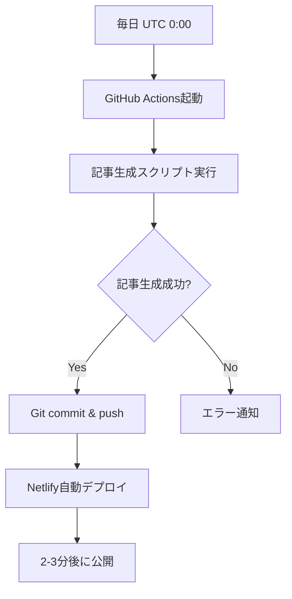

# TaskMate ブログ 自動化セットアップガイド

## 📋 概要

このドキュメントは、TaskMateブログの記事を毎日自動生成・公開するための設定手順をまとめたものです。

---

## ✅ 現在の自動化状況

### 設定済みの項目
- ✅ GitHub Actionsワークフロー (`.github/workflows/auto-publish.yml`)
- ✅ 記事生成スクリプト (`scripts/generate-article.js`)
- ✅ Netlify自動デプロイ設定 (`netlify.toml`)
- ✅ GitHubリポジトリ (IKEMENLTD/TaskMate-SEO)

### 動作スケジュール
- **毎日 UTC 0:00（日本時間 午前9時）** に自動実行
- 手動実行も可能（GitHubのActionsタブから）

---

## 🔧 必要な設定（要確認）

### 1. GitHub Secretsの設定

GitHub ActionsでAnthropic APIを使用するため、以下のシークレットが必要です。

#### 必須シークレット

**`ANTHROPIC_API_KEY`**
- 現在のAPIキー: ローカル環境変数として設定済み
- 設定場所: `https://github.com/IKEMENLTD/TaskMate-SEO/settings/secrets/actions`

#### 設定手順:

```bash
1. GitHubリポジトリにアクセス
   https://github.com/IKEMENLTD/TaskMate-SEO

2. Settings → Secrets and variables → Actions → New repository secret

3. 以下を入力:
   Name: ANTHROPIC_API_KEY
   Secret: [あなたのAnthropic APIキーをここに貼り付け]

4. [Add secret] をクリック
```

#### オプションシークレット（通知機能）

**`SLACK_WEBHOOK_URL`** （オプション）
- 記事生成の成功/失敗をSlackに通知
- 設定方法は上記と同じ

---

## 🚀 動作確認方法

### 方法1: 手動トリガーで確認

1. GitHubリポジトリの**Actionsタブ**にアクセス
   ```
   https://github.com/IKEMENLTD/TaskMate-SEO/actions
   ```

2. 左サイドバーから **"Auto Generate and Publish Blog Article"** を選択

3. 右上の **"Run workflow"** ボタンをクリック

4. （オプション）日付を指定する場合:
   ```
   date: 2025-11-04
   ```
   空欄の場合は今日の日付で生成

5. **"Run workflow"** をクリックして実行

### 方法2: スケジュール実行を待つ

- 毎日 **UTC 0:00（日本時間 午前9時）** に自動実行されます
- 実行ログは上記Actionsタブで確認可能

---

## 📝 記事生成の流れ

### 自動実行時の処理フロー



### 処理ステップ詳細

1. **トリガー**: スケジュール or 手動実行
2. **環境構築**: Node.js 20, 依存関係インストール
3. **記事生成**:
   - トピックJSONから未使用トピックを選択
   - Anthropic APIで記事生成（7000-9000文字）
   - Markdownファイル作成
4. **品質チェック**:
   - 文字数確認
   - 絵文字・SVG削除
   - フロントマター検証
5. **コミット＆プッシュ**:
   - 変更があれば自動コミット
   - mainブランチにプッシュ
6. **デプロイ**:
   - Netlifyが自動検知
   - ビルド＆デプロイ（2-3分）

---

## 🔍 トラブルシューティング

### 問題1: 記事が生成されない

**症状**: GitHub Actionsは動いているが、記事が作成されない

**原因と対処法**:

1. **トピックが残っていない**
   ```bash
   # scripts/article-topics.json を確認
   cat scripts/article-topics.json

   # "used": false のトピックが残っているか確認
   ```

   対処: 新しいトピックを追加するか、usedをfalseにリセット

2. **API Key が設定されていない**
   ```
   Settings → Secrets → ANTHROPIC_API_KEY を確認
   ```

3. **すでに同じ日付の記事が存在**
   ```bash
   # content/posts/ 内を確認
   ls -la content/posts/*2025-11-01*.md
   ```

   対処: 該当ファイルを削除して再実行

### 問題2: GitHub Actionsが失敗する

**確認手順**:

1. Actionsタブでエラーログを確認
   ```
   https://github.com/IKEMENLTD/TaskMate-SEO/actions
   ```

2. 失敗したステップを特定:
   - `Install dependencies` → package.jsonの問題
   - `Generate new article` → API key or スクリプトエラー
   - `Commit and push` → Git設定の問題

3. ローカルでの再現テスト:
   ```bash
   cd "/mnt/c/Users/music-020/Downloads/TaskMateブログ/TaskMateブログ"
   export ANTHROPIC_API_KEY="あなたのAPIキー"
   node scripts/generate-article.js
   ```

### 問題3: Netlifyデプロイが失敗する

**確認手順**:

1. Netlifyダッシュボードにアクセス
   ```
   https://app.netlify.com/
   ```

2. ビルドログを確認

3. よくあるエラー:
   - **Next.js ビルドエラー**: `npm run build` をローカルで確認
   - **環境変数不足**: Netlify環境変数を確認
   - **メモリ不足**: Netlifyプランを確認

---

## 📊 記事品質チェック項目

### 自動チェック項目（スクリプトで検証）

- ✅ 文字数: 7000-9000文字
- ✅ 絵文字削除（🔧、📝など）
- ✅ SVGアイコン削除
- ✅ フロントマター必須項目:
  - `title`
  - `date`
  - `description`
  - `category`
  - `tags`
  - `slug`

### 手動確認推奨項目

- 記事の内容が読みやすいか
- TaskMateへの導線（CTA）が適切か
- 画像リンクが正しいか
- 内部リンクが機能しているか

---

## 🎯 今後の改善案

### 短期的改善（すぐ実装可能）

1. **文字数最適化の自動化**
   - 生成時に7000-9000文字に自動調整
   - 長すぎる場合は自動トリミング
   - 短すぎる場合は再生成

2. **品質チェック強化**
   - リンク切れチェック
   - 画像存在確認
   - SEOスコア算出

3. **通知機能拡充**
   - Slack通知の有効化
   - LINE通知オプション
   - メール通知

### 中長期的改善

1. **A/Bテスト機能**
   - タイトルバリエーション生成
   - クリック率測定

2. **SEO最適化**
   - キーワード密度チェック
   - メタ情報最適化
   - 構造化データ追加

3. **アナリティクス連携**
   - PV数自動取得
   - 人気記事分析
   - トピック推奨

---

## 📞 サポート

### 問題が解決しない場合

1. **GitHub Issuesで報告**
   ```
   https://github.com/IKEMENLTD/TaskMate-SEO/issues/new
   ```

2. **ローカルログ確認**
   ```bash
   cd "/mnt/c/Users/music-020/Downloads/TaskMateブログ/TaskMateブログ"
   git log --oneline -10  # 最近のコミット確認
   ```

3. **強制再実行**
   ```bash
   # ローカルで手動実行
   export ANTHROPIC_API_KEY="あなたのAPIキー"
   INPUT_DATE="2025-11-04" node scripts/generate-article.js

   # 成功したらコミット＆プッシュ
   git add content/posts/*.md
   git commit -m "Manual article generation for 2025-11-04"
   git push
   ```

---

## 📅 定期メンテナンス

### 月次確認事項

- [ ] API使用量確認（Anthropic ダッシュボード）
- [ ] トピックJSON補充（scripts/article-topics.json）
- [ ] Netlifyビルド時間確認
- [ ] 記事品質レビュー（ランダムサンプリング）

### 四半期確認事項

- [ ] SEOパフォーマンス分析
- [ ] 記事テーマの見直し
- [ ] 自動化スクリプトの最適化
- [ ] 新機能追加検討

---

## 🔗 関連リソース

- **本番サイト**: https://elegant-gumdrop-9a983a.netlify.app/
- **GitHubリポジトリ**: https://github.com/IKEMENLTD/TaskMate-SEO
- **Netlifyダッシュボード**: https://app.netlify.com/
- **Anthropic API Docs**: https://docs.anthropic.com/

---

**最終更新**: 2025年11月3日
**バージョン**: 1.0
